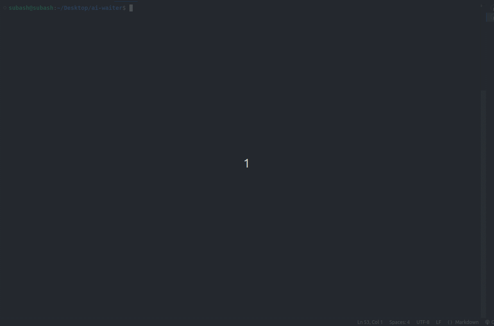

<a id="readme-top"></a>
[![LinkedIn][linkedin-shield]][linkedin-url]

<br />
<div align="center">
  <h3 align="center">AI Waiter</h3>

  <p align="center">
    An awesome ai waiter for your restaurant
    <br />
  </p>
</div>

<!-- ABOUT THE PROJECT -->

## About The Project

A command line ai waiter for a fictional mixed restaurant built using javascript, lang chain and gemini.

### Built With

Javascript, langchain, gemini

- [![Javascript][Javascript]][Javascript-url]
- [![langchain][langchain-shield]][langchain-url]
- [![gemini][gemini-shield]][gemini-url]

<!-- GETTING STARTED -->

## Getting Started

- Clone this repository

```sh
git clone git@github.com:subash-poudel/ai-waiter.git
```

- Install dependencies

```sh
git clone git@github.com:subash-poudel/ai-waiter.git
```

- Start the app

```sh
npx nodemon ai-waiter.js
```

Note: If you don't have nodemon installed globally then you might be prompted to install it first.

## App in action


<!-- MARKDOWN LINKS & IMAGES -->
<!-- https://www.markdownguide.org/basic-syntax/#reference-style-links -->

[linkedin-shield]: https://img.shields.io/badge/-LinkedIn-black.svg?style=for-the-badge&logo=linkedin&colorB=555
[linkedin-url]: https://www.linkedin.com/in/its-subash/
[product-screenshot]: images/screenshot.png
[Javascript]: https://img.shields.io/badge/JavaScript-323330?style=for-the-badge&logo=javascript&logoColor=F7DF1Es
[Javascript-url]: https://en.wikipedia.org/wiki/JavaScript
[langchain-shield]: https://img.shields.io/badge/langchain-1C3C3C?style=for-the-badge&logo=langchain&logoColor=white
[langchain-url]: https://js.langchain.com/docs/introduction/
[gemini-shield]: https://img.shields.io/badge/Google%20Gemini-8E75B2?style=for-the-badge&logo=googlegemini&logoColor=white
[gemini-url]: https://gemini.google.com/app
